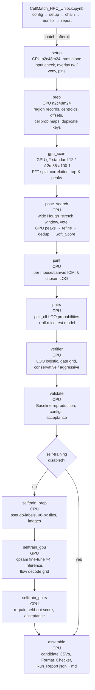

# Design Document: hpc-registration-unlock

## Overview

This design turns the existing research registration stack (`research/`) into a resumable SLURM Job_Chain on NYU Cloud Bursting. The user uploads the project folder to `/scratch/$USER/cellmatch` and drives everything from one JupyterLab notebook. The chain adds four things on top of the v10 recipe (`submission_v10_cpgate.csv`, public 0.48893):

1. A GPU dense pose scan (FFT correlation of Gaussian centroid splats over angle × scale × stretch × translation). Its top-K peaks are added to the existing Hough, window and vote candidates.
2. Soft_Score selection plus joint per-mouse selection (ICM over each mouse/canvas group).
3. A learned Pose_Verifier with a conservative and an aggressive gate, OR-ed with the v10 gate.
4. A GPU self-training stage that fine-tunes ex-vivo Cellpose-SAM on pseudo-labels from confidently registered regions. It is validated leave-one-mouse-out before any test CSV is written.

All heavy work runs on HPC. Locally only a ≤300 s smoke test runs.

### Measured facts this design builds on (held-out, 46 regions with a GT affine)

| Fact | Number | Source |
| --- | --- | --- |
| Soft objective (σ 1.5–2.5) ranks the true pose above all wrong candidates | 39–40 / 46 | `research/objective_probe.py` |
| Wide Hough + stretch has a correct candidate | 40 / 46 | `research/wide_soft.py` |
| Correct pose chosen by Soft_Score vs refine score | 34 / 46 vs 25–28 | `research/wide_soft.py` |
| Soft-margin gate alone is weak (union with v10 gate) | F1 0.4693 vs 0.4674 | `research/soft_gate_cv.py` |
| v10 gate (margin ≥ 3 or cellprob z ≥ 5): kept / correct | 31 / 29 | `research/cp_pose_lab.py` |
| True transforms are anisotropic | 5–9 % | GT affine SVD |
| Test regions with pairs in v10 | 11 / 29 | `submission_v10_cpgate.csv` |
| On test, v10-gated regions mostly agree with the soft pose | — | `research/test_soft_probe.py` |

### Honest score outlook

A public score above 0.65 is the target. It is not guaranteed. With v10 masks, the gain must come from unlocking more of the 18 unpaired test regions. If every test region got a correct pose at v10 pair precision, pooled F1 would rise from about 0.40 to about 0.60, which gives a public estimate of about 0.60–0.63. Above that, ex-vivo PQ has to rise, which is why self-training is part of the chain. Earlier self-training and boundary experiments (README v8–v12) failed out of mouse. The acceptance rule (Requirement 9) therefore writes CSVs only when they beat the held-out Baseline, and `submission_v10_cpgate.csv` stays the safe final.

### Key design decisions

| Decision | Choice | Rationale |
| --- | --- | --- |
| Notebook | New `CellMatch_HPC_Unlock.ipynb`; one pointer cell added at the top of `CellMatch_HPC.ipynb` | The existing notebook's single Run-All cell submits the old training chain and overwrites `submission.csv`. Mixing both in one notebook risks running both. The new notebook fills the HPC_Notebook role in the requirements (the glossary names `CellMatch_HPC.ipynb, extended`; the pointer cell keeps that entry point). |
| Code layout | New `hpc_unlock/` package that wraps `research/` functions; no rewrites of `registration.refine`, `pair_clf.candidates`, `cp_pose_lab.cp_z`, `hough`, `vote`, `pipeline.cellpose_*` | The v10 numbers came from these functions. Reusing them is how the Baseline is reproduced exactly. |
| One SLURM job per Stage | `run_unlock.py <stage>` per job, chained with `afterok` | Matches Req 2.4. A failed Stage resubmits alone. Done-markers skip finished work. |
| Scan score | Correlation of Gaussian splats via batched FFT (Req 5.4, second option) | Keeps the L4 busy with large batched FFTs. The exact mutual-nearest Soft_Score is recomputed on CPU after refine. |
| Verifier model | L2 logistic regression on standardized features | Only 46 labelled regions (~30 per LOO fold). Gradient boosting with that little data reduces to one or two splits. |
| Joint solver | ICM with deterministic restarts, exhaustive when the search space is ≤ 10⁵ | Groups have ≤ 18 regions × ≤ 10 candidates. ICM is monotone, deterministic and reduces to independent argmax at λ = 0. |
| Self-trained test masks | Fine-tuned flows, then the same 15 % cellprob-ranked ring grow as v7_grow15 | Public scores showed grow15 matches the test convention (README v10–v12). Held-out comparison stays ungrown on both sides, as for the Baseline (ex PQ 0.3901). |

## Architecture

### Job_Chain



When self-training is disabled, the submit cell does not submit `selftrain_prep`, `selftrain_gpu` or `selftrain_pairs`. `assemble` then depends on `validate` (Req 12.2).

### Stage table

| # | Stage | Partition | Main inputs | Checkpoint (under `research/data/hpc/<fp>/`) | Time limit |
| --- | --- | --- | --- | --- | --- |
| 0 | setup | n2c48m24, 4 CPU, 16G | pins file, input list, overlay + `.sif` (singularity mode) | `research/data/hpc/setup/setup.json` (env mode, env path, `.sif`, versions, `torch.version.cuda`) | 1 h |
| 1 | prep | n2c48m24, 32 CPU, 20G | `lab.pkl`, `heldout_labels.npz`, `research/data/submission.csv`, `test_cp_base.npz`, TIFFs | `prep.pkl` | 1 h |
| 2 | gpu_scan | GPU, 8 CPU, 40G (L4) / 64G (A100) | `prep.pkl` | `gpu_scan.pkl` | 3 h |
| 3 | pose_search | n2c48m24, 32 CPU, 20G | `prep.pkl`, `gpu_scan.pkl`, `cp_pose_train.pkl`, `vote_cands.pkl` | `pose_search.pkl` | 3 h |
| 4 | joint | n2c48m24, 16 CPU, 16G | `pose_search.pkl`, `prep.pkl` | `joint.pkl` | 1 h |
| 5 | pairs | n2c48m24, 16 CPU, 16G | `joint.pkl`, `prep.pkl` | `pairs.pkl` | 1 h |
| 6 | verifier | n2c48m24, 8 CPU, 8G | `joint.pkl`, `pairs.pkl` | `verifier.pkl` | 30 min |
| 7 | validate | n2c48m24, 16 CPU, 20G | all of the above, `heldout_labels.npz`, GT | `validate.pkl` | 1 h |
| 8 | selftrain_prep | n2c48m24, 32 CPU, 32G | `validate.pkl`, masks, TIFFs | `selftrain_prep.pkl` + `selftrain_tiles.npz` | 1 h |
| 9 | selftrain_gpu | GPU, 8 CPU, 40G / 64G | `selftrain_prep.*` | `selftrain_gpu.pkl` + `selftrain_flows/*.npz` + fine-tuned models | 8 h |
| 10 | selftrain_pairs | n2c48m24, 32 CPU, 32G | `selftrain_gpu.pkl`, `validate.pkl` | `selftrain_pairs.pkl` | 2 h |
| 11 | assemble | n2c48m24, 8 CPU, 16G | `validate.pkl`, optional `selftrain_pairs.pkl`, Baseline CSV | `assemble.json`; root `hpc_unlock_report.{json,md}`, `submission_v13_*.csv` | 30 min |

CPU and memory values are defaults in the config cell. The real memory of `n2c48m24` nodes has not been checked from here. The existing `hpc/cpu.sbatch` runs with 16 CPU / 20G, so 32 CPU / 20G is the starting request. If the scheduler rejects it, the user can lower it in the config cell.

### File layout

```
Assign-2/                         (uploaded as /scratch/$USER/cellmatch)
├── run_unlock.py                 driver: run_unlock.py <stage> [--smoke] | submit | monitor | check
├── CellMatch_HPC_Unlock.ipynb    HPC_Notebook
├── hpc_unlock/
│   ├── __init__.py
│   ├── paths.py                  ROOT from __file__; sys.path for ROOT and ROOT/research; all paths
│   ├── config.py                 UnlockConfig dataclass, validation, fingerprint, load/save
│   ├── checkpoint.py             atomic save/load, done-markers, run_stage()
│   ├── chain.py                  stage graph, sbatch command builder, submit, monitor, sacct parsing
│   ├── prep.py                   region records (held-out + test), duplicate keys, scan inputs
│   ├── gpu_scan.py               torch FFT dense scan (CUDA, or CPU in smoke)
│   ├── pose_search.py            wide Hough + stretch, window/vote merge, refine, dedup, features
│   ├── soft.py                   Soft_Score, Soft_Margin, landing, pose decomposition
│   ├── joint.py                  grouping, joint objective, ICM solver, λ selection
│   ├── pairs.py                  pair_clf wrappers for arbitrary records, LOO + test models
│   ├── verifier.py               LOO logistic verifier, gate grid, gate selection
│   ├── validate.py               PQ / F1 / full score, Baseline reproduction, acceptance
│   ├── selftrain_prep.py         pseudo-labels, 96-px tiles, image packing
│   ├── selftrain_gpu.py          cpsam fine-tune, inference, flow decode grid
│   ├── selftrain_pairs.py        re-pairing on new ex masks, held-out score, acceptance
│   ├── assemble.py               candidate CSV writer, Format_Checker, unlock table
│   ├── report.py                 Run_Report json + md
│   └── smoke.py                  local smoke test
├── hpc/unlock/
│   ├── requirements-unlock.txt   pinned versions
│   ├── run_in_env.sh             runs a command in the selected env (singularity exec or venv)
│   ├── stage.sbatch              generic CPU Stage script (env mode + stage name as arguments)
│   ├── gpu_stage.sbatch          generic GPU Stage script with nvidia-smi logger, --nv
│   ├── setup.sbatch              input check, overlay :rw env build / venv build, pins
│   ├── setup_overlay.sh          runs inside the container: Miniconda, /ext3/env.sh, pins
│   ├── kernel/kernel.json        optional OOD Jupyter kernel that runs inside the container
│   └── container/                git-ignored: overlay-15GB-500K.ext3 + CUDA .sif (copied by scp)
└── tests/unlock/                 pytest + hypothesis (local, light)
```

`paths.py`, `config.py` and `chain.py` import only the Python standard library, so the notebook can import them from a plain Python kernel and call `sbatch` / `squeue` / `sacct` through `subprocess`. Each Stage module exposes `compute(cfg, ctx) -> object`. `run_unlock.py` resolves the Stage, checks its preconditions (SLURM allocation, GPU visibility, config validity), and calls `checkpoint.run_stage(name, compute)`.

### Path resolution (Req 1.1)

`hpc_unlock/paths.py` sets `ROOT = Path(__file__).resolve().parents[1]`. Every path is derived from it: `DATA = ROOT/"Project_2_Dataset"`, `RDATA = ROOT/"research"/"data"`, `HPC = RDATA/"hpc"`, `LOGS = ROOT/"logs"`. The research modules already resolve their caches relative to `__file__` (`HERE`). They are imported after `sys.path.insert(0, ROOT)` and `sys.path.insert(0, ROOT/"research")`. Modules that read `data/...` relative to the working directory at import time (`objective_probe`, `soft_gate_cv`) are not imported. Their logic is re-expressed in `hpc_unlock/soft.py`, which calls `wide_soft.soft`, which is a pure function. The sbatch scripts `cd "$SLURM_SUBMIT_DIR"`, and the notebook submits with `cwd=WORK`. `WORK` is the notebook's own directory if it contains `hpc_unlock/`. Otherwise it is `$CELLMATCH_DIR` or `/scratch/$USER/cellmatch`. No path contains a NetID.

### Environment (Req 1.2–1.7)

`hpc/unlock/requirements-unlock.txt` pins the versions in the local `.venv` (Python 3.12.13). The same pins apply in both environment modes:

```
# MINICONDA_INSTALLER=Miniconda3-py312_<pinned version>-Linux-x86_64.sh   (singularity mode only)
numpy==2.5.3
scipy==1.18.1
opencv-python-headless==5.0.0.93
scikit-learn==1.9.1
tifffile==2026.9.20
pandas==3.0.6
scikit-image            # pinned to the version resolved in setup.json at first install
torch==2.14.0           # default PyPI Linux wheel (bundles CUDA 12 runtime), not the cu118 index
cellpose==4.2.1.1       # only when self-training is enabled
```

**Cluster defaults.** NYU Cloud Bursting, reached with `ssh greene` then `ssh burst`, or through Burst OOD. Account `cs_gy_6923-2026fa`, CPU partition `n2c48m24`, GPU partition `g2-standard-12` (L4), `c12m85-a100-1` (A100) selectable. Every path uses `/scratch/$USER/...` or the Project_Folder root. No NetID and no other account appears anywhere as a default.

**Two environment modes**, chosen by `ENV_MODE` in the notebook config cell (`UnlockConfig.env_mode`):

| Mode | Default | Environment | How a Stage runs |
| --- | --- | --- | --- |
| `singularity` | yes | conda env `unlock` (Python 3.12) in `/ext3/miniconda3` inside the ext3 overlay `hpc/unlock/container/overlay-15GB-500K.ext3` | `singularity exec [--nv] --overlay <overlay>:ro <sif> /bin/bash -c "source /ext3/env.sh; cd <WORK>; python run_unlock.py <stage> --run <fp>"` |
| `venv` | no | existing miniforge path from `hpc/env.sh` (`env/` reused, or `env_unlock/` created) | `source hpc/env.sh` with `hpc/unlock/.env_path`, then `python run_unlock.py <stage> --run <fp>` |

`hpc/unlock/run_in_env.sh <mode> <gpu:0|1> -- <command>` builds either form, so `stage.sbatch` and `gpu_stage.sbatch` share one code path. `--nv` is passed only on GPU Stages. CPU Stages do not need the host driver.

**Container files (singularity mode).** NYU recommends a Singularity image plus an ext3 overlay. Burst does not see Greene's `/scratch/work/public`, so the user copies both files from `greene-dtn` once, from a Burst login shell. The notebook's first instruction cell prints these commands with `WORK` filled in:

```bash
scp greene-dtn:/scratch/work/public/overlay-fs-ext3/overlay-15GB-500K.ext3.gz "$WORK/hpc/unlock/container/" && gunzip "$WORK/hpc/unlock/container/overlay-15GB-500K.ext3.gz"
scp greene-dtn:/scratch/work/public/singularity/<sif> "$WORK/hpc/unlock/container/"
```

`<sif>` is a CUDA 12 image if `ssh greene-dtn ls /scratch/work/public/singularity/ | grep -i cuda12` lists one, else `cuda11.8.86-cudnn8.7-devel-ubuntu22.04.2.sif`. `paths.find_sif()` picks the `.sif` in `container/`: a name containing `cuda12` first (highest version string), else the CUDA 11.8 file. Neither container file is in git (`.gitignore` gets `hpc/unlock/container/`).

**Setup Stage, singularity mode.** `setup.sbatch` starts with `module purge`, runs the input check (Req 1.6, which includes the overlay and `.sif`), then runs `hpc/unlock/setup_overlay.sh` with `singularity exec --overlay <overlay>:rw <sif>`:
1. If `/ext3/miniconda3` is missing, it downloads the pinned Miniconda installer (`MINICONDA_INSTALLER` in `requirements-unlock.txt`), installs it with `bash <installer> -b -p /ext3/miniconda3`, and writes `/ext3/env.sh`: `source /ext3/miniconda3/etc/profile.d/conda.sh`, `export PATH=/ext3/miniconda3/bin:$PATH`, `conda activate unlock`. Then it runs `conda install -y pip ipykernel`.
2. It checks the core pins in the env `unlock` with `importlib.metadata.version` (decision rule `reuse_env`, Property 7). If every core pin matches, the env is reused. Otherwise it removes `unlock` and creates it again with `conda create -y -n unlock python=3.12`, then `pip install` of each pinned package (Req 1.3).
3. It runs `pip install torch==2.14.0` from the default PyPI index on every chain run (Req 1.4). The CUDA 11.8 image has no matching cu118 wheel for recent torch, so the cu118 index is not used. The default Linux wheel bundles the CUDA 12 runtime and only needs the host driver that `--nv` mounts, which the L4 and A100 drivers on Burst should satisfy (unverified from here). The CUDA toolkit inside the `.sif` is not used by torch.
4. Unless self-training is disabled, it installs `cellpose==4.2.1.1` and caches the `cpsam_v2` weights (the Cellpose-SAM model used by `pipeline.cellpose_model`) into `$WORK/hpc/unlock/models` (`CELLPOSE_LOCAL_MODELS_PATH`), outside the overlay, so read-only Stage jobs can load them (Req 1.5).
5. It writes `setup.json`: env mode, env path, `.sif` name, every installed pin version, `torch.__version__` and `torch.version.cuda`. It does no CUDA check, because the setup job runs on a CPU node.

Each `pip install` is a separate command under `set -e` with a trap that echoes `PIN_FAILED <package>`, so a failed package is named, the job exits non-zero, and no dependent Stage runs (Req 1.7).

**Single writer for the overlay.** Only one job can mount an ext3 overlay `:rw`, and no other job can mount it while it is held `:rw`. So setup runs alone: notebook Step 2 submits only `setup`, and Step 3 submits the chain from `prep` with `--dependency=afterok:<setup job id>` while setup is pending or running, or with no dependency once `sacct` shows setup `COMPLETED` and `setup.json` exists. If setup failed, Step 3 refuses and shows the setup log. All Stage jobs mount the overlay `:ro`, which several jobs can do at once. Setup is not skipped by a done-marker: it runs on every chain run (Req 1.4) and is fast when the env already matches.

**Setup Stage, venv mode.** `setup.sbatch` starts with `module purge` and sources `hpc/env.sh` (miniforge and env inside the project). It runs `importlib.metadata.version` on the existing `env/`. If every core pin matches, it reuses `env/`. Otherwise it creates `env_unlock/` with Python 3.12, so the old pipeline's env is left untouched. The chosen env path is written to `hpc/unlock/.env_path`, which every Stage script sources. Steps 3–5 above then run in that env.

**sbatch flags.** Every sbatch command also carries `--requeue`, so preempted Burst jobs rerun and resume from done-markers. Every sbatch script starts with `module purge` and `cd "$SLURM_SUBMIT_DIR"`.

**Torch/CUDA check at GPU start.** No separate GPU smoke job is submitted, because an idle GPU job wastes allocation and Burst kills low-utilization GPU jobs. Instead `gpu_scan` and `selftrain_gpu` print one line at start, `TORCH_INFO version=<torch.__version__> cuda=<torch.version.cuda> available=<bool> device=<name>`, before the GPU-visibility check (Req 5.9, 12.14).

**Optional OOD Jupyter kernel.** The notebook needs only a plain Python 3 kernel with the standard library: it calls `sbatch`, `squeue` and `sacct` through `subprocess` on the Burst login node or an OOD session. To run analysis cells with the pinned packages, the user can register a container kernel after setup has finished: copy `hpc/unlock/kernel/kernel.json` to `~/.local/share/jupyter/kernels/cellmatch-unlock/`. Its `argv` runs `singularity exec --overlay <overlay>:ro <sif> /bin/bash -c "source /ext3/env.sh; python -m ipykernel_launcher -f {connection_file}"`. While that kernel is running it holds the overlay `:ro`, so it must be shut down before setup is resubmitted.

### Resource placement (Req 3)

- CPU Stages run on `n2c48m24`. Worker count: `int(SLURM_CPUS_PER_TASK)` if set, else `len(os.sched_getaffinity(0))`. The result is clamped to `[1, len(os.sched_getaffinity(0))]`. Workers use `multiprocessing.get_context("fork").Pool`. `OMP_NUM_THREADS`, `OPENBLAS_NUM_THREADS` and `MKL_NUM_THREADS` are set to 1 per worker.
- GPU Stages load only Checkpoints written by a preceding CPU Stage (`prep`, `selftrain_prep`). They contain no `registration.refine`, no HistGradientBoosting, no validation and no CSV writing.
- `gpu_stage.sbatch` starts `nvidia-smi --query-gpu=timestamp,utilization.gpu,memory.used --format=csv,noheader -l 60 &` and writes to the Stage log. It kills that process on exit (`trap`). This gives one line of GPU use per minute (Req 3.4).
- Before any region is processed, `run_unlock.py` checks for a SLURM allocation (`SLURM_JOB_ID`) unless `--smoke` is given (Req 13.6). GPU Stages also check `torch.cuda.is_available()` (Req 5.9, 12.14).

## Components and Interfaces

### config.py

```python
@dataclass(frozen=True)
class UnlockConfig:
    account: str = "cs_gy_6923-2026fa"
    cpu_partition: str = "n2c48m24"
    gpu_partition: str = "g2-standard-12"        # or "c12m85-a100-1"
    env_mode: str = "singularity"                # or "venv"
    sif_name: str | None = None                  # None = paths.find_sif() (CUDA 12 first, else CUDA 11.8)
    disable_selftrain: bool = False
    sigma: float = 2.5                           # Soft_Score σ, [1.5, 2.5]
    scan_k: int = 50                             # [1, 500]
    scan_angle_step: float = 0.5                 # ≤ 0.5
    scan_scale_step: float = 0.01                # ≤ 0.01
    scan_cell_px: float = 2.0                    # translation grid, ≤ 2
    joint_lambdas: tuple = (0.0, 2.0, 5.0, 10.0, 20.0)
    joint_top_l: int = 10
    match_radius: float = 6.0                    # [1, 20]
    seed_radius: float = 6.0                     # [1, 20]
    st_epochs: int = 60
    st_tiles_per_epoch: int = 128
    st_batch: int = 8
    st_decode_grid: tuple = ((-0.5, 0.15), (-0.5, 0.4), (0.0, 0.15), (0.0, 0.4), (0.5, 0.15), (0.5, 0.4))
    st_grow15: bool = True
    resources: dict = ...                        # per-Stage cpus / mem / time
    def validate(self) -> list[str]: ...         # all errors, not only the first
    def fingerprint(self) -> str: ...            # sha1 of result-affecting fields, 10 hex chars
```

`validate()` returns an error string for each of: partition not in `{"g2-standard-12", "c12m85-a100-1"}` (Req 2.3); σ outside [1.5, 2.5] (4.8); K not an int in [1, 500] (5.11); either radius outside [1, 20] (12.13); `env_mode` not in `{"singularity", "venv"}`. The notebook config cell prints the errors and refuses to submit. Each Stage re-validates its own fields before touching any region and exits non-zero without a done-marker. Default σ is 2.5, the value behind the 34/46 measurement.

`fingerprint()` hashes only the fields that change results (σ, scan, joint, self-training parameters). It excludes account, partitions, env mode, `.sif` name, resources and `disable_selftrain`. Checkpoints live in `research/data/hpc/<fingerprint>/`, so a changed σ never reuses stale Checkpoints. The submit cell writes `run_config.json` there, and every Stage reads it from `--run <fingerprint>`.

### checkpoint.py

```python
def save_atomic(path: Path, obj) -> None        # pickle protocol 5 → path.tmp-<pid>, fsync, os.replace
def load(path: Path)                            # pickle.load; raises on missing/corrupt
def run_stage(name: str, compute: Callable[[], object], root: Path) -> object
```

`run_stage` behaves as follows:
1. If `<name>.done` and `<name>.pkl` both exist and `load` succeeds, and the SHA-256 in the marker matches the file, it logs `REUSE <name>` and returns the loaded object (Req 3.7).
2. If the marker exists but the Checkpoint is missing or fails to load, it logs `INCONSISTENT <name>: <reason>`, deletes the marker, and recomputes (3.8).
3. Otherwise it runs `compute()`, then `save_atomic`, then writes the marker atomically. The marker holds `{"stage", "sha256", "fingerprint", "finished"}` (3.9).

An exception, SIGTERM (preemption; the scripts use `--requeue`) or timeout before step 3 finishes leaves no marker (3.10). Large array side outputs (`selftrain_tiles.npz`, flows) are written with the same temp-then-rename rule before the main Checkpoint. The main Checkpoint stores their paths and SHA-256 values, so a missing side file fails the load in step 1.

### chain.py

```python
STAGES = ["setup", "prep", "gpu_scan", "pose_search", "joint", "pairs", "verifier", "validate",
          "selftrain_prep", "selftrain_gpu", "selftrain_pairs", "assemble"]
GPU_STAGES = {"gpu_scan", "selftrain_gpu"}
SELFTRAIN = {"selftrain_prep", "selftrain_gpu", "selftrain_pairs"}

def plan(cfg, start: str = "setup") -> list[str]          # drops SELFTRAIN when disabled
def sbatch_argv(cfg, stage, dep: str | None) -> list[str] # pure; tested
def submit_setup(cfg) -> tuple[str, str, str]              # setup alone (overlay :rw)
def submit(cfg, start="prep") -> list[tuple[str, str, str]]   # (stage, partition, jobid)
def monitor(cfg) -> MonitorView                            # squeue + sacct + log tails + done list
def resubmit_command(cfg, stage) -> str                    # "python run_unlock.py submit --from <stage> --run <fp>"
```

`sbatch_argv` returns `["sbatch", "--parsable", f"--account={account}", f"--partition={p}", f"--mem={mem}", f"--cpus-per-task={c}", f"--time={t}", "--export=NONE", "--requeue", f"--job-name=unlock-{stage}", f"--output=logs/unlock-{stage}-%j.out"]`. GPU Stages add `--gres=gpu:1`. Every Stage after the first adds `--dependency=afterok:<previous jobid>`. The script and its arguments come last: `hpc/unlock/setup.sbatch <env_mode> [--no-cellpose]`, `hpc/unlock/stage.sbatch <env_mode> <stage> --run <fp>` or `hpc/unlock/gpu_stage.sbatch <env_mode> <stage> --run <fp>`. Because of `--export=NONE`, the env mode and run fingerprint travel as script arguments, not environment variables.

`submit_setup(cfg)` submits only `setup` and records its job ID in `research/data/hpc/setup/job.json`. `submit(cfg, start="prep")` reads that job ID: pending or running → the first chain Stage gets `--dependency=afterok:<setup id>`; `COMPLETED` (per `sacct`) with `setup.json` present → no dependency; any other state or no setup job → it refuses with the setup log path. This keeps the overlay's single `:rw` mount (setup) apart from every `:ro` Stage mount. `submit` runs the commands in order with `SLURM_*` variables removed from the environment, as the existing notebook does. On the first non-zero return code it stops, prints stderr, and submits nothing more (Req 2.9). It writes `research/data/hpc/<fp>/jobs.json` for the monitor.

`monitor` reads `jobs.json`. For each job it shows the `squeue -h -j <id> -o %T` state, or the `sacct -n -X -o State,ExitCode` state once the job leaves the queue. It shows the last 40 lines of each log, or `log not created yet`, and the list of `*.done` files. For any job in `FAILED`, `TIMEOUT`, `CANCELLED*`, `OUT_OF_MEMORY` or with a non-zero exit code, it prints the Stage name, log path and `resubmit_command` (Req 2.8). Dependents of a failed job stay pending with `DependencyNeverSatisfied`. The monitor tells the user to `scancel` them before resubmitting.

### prep.py (CPU, precedes gpu_scan)

It builds one `RegionRecord` per region:
- **Held-out:** loaded from `research/data/lab.pkl` (`iv_c`, `ex_c`, `iv_f`, `ex_f`, `iv_link`, `ex_link`, `gt_pairs`, `n_gt_pairs`, `gt_iv_c`, `gt_M`, `offset`).
- **Test:** built with `test_apply.build` on `research/data/submission.csv` (the ungrown v7 masks, whose IDs match v7_grow15 and v10), with `offset` from `common.crop_offsets("hidden_test")`.

For each record it also adds:
- `cp_bin`: `cp_pose_lab.cp_map` of the ex-vivo cellprob (`heldout_labels.npz[sid|exvivo|prob]` or `test_cp_base.npz[sid|cp]`), stored as uint8.
- `dup_key`: SHA-1 of the raw in-vivo bytes + raw ex-vivo bytes. This is stricter than `test_apply`'s centroid hash and matches Req 6.4 (pixel-identical).
- `group`: `(subject, ex_shape)`.

The GPU scan input per unique `dup_key` holds `iv_c`, `ex_c`, `ex_shape`, `offset` (float32). The vote candidates come from `research/data/vote_cands.pkl` for held-out and from `test_apply.cands` for test. Vote modes per group come from `vote.vote_modes`, with duplicates voting once, as in `test_cp_apply.py`. Window candidates for test come from `cp_pose_lab.all_window`. For held-out they are taken from `cp_pose_train.pkl`, which holds the exact window and vote candidates behind v10.

### gpu_scan.py (GPU)

**Grid (Req 5.1, 5.2).** Angles come from `np.linspace(-35, 35, n_a)` with `n_a = ceil(70 / step) + 1`, giving 141 at 0.5°. Scales come from `np.linspace(0.85, 1.13, n_s)`, giving 29 at 0.01. Both endpoints are exact. There are 17 stretch hypotheses: `S(k, φ) = I + (k − 1) u uᵀ`, `u = (cos φ, sin φ)` (as `wide_soft.stretch`) for k ∈ {0.92, 0.96, 1.04, 1.08} and φ ∈ {0°, 45°, 90°, 135°}, plus k = 1.00 once with φ = None. A grid pose has linear part `A = s · R(θ) · S(k, φ)`, giving 141 × 29 × 17 = 69,513 linear parts per region.

**Score (Req 5.4).** The cell size is `c = 2 px`. Ex-vivo centroids `q_j / c` are bilinearly splatted into a grid `E` of size `⌈H/c⌉ × ⌈W/c⌉`. For a pose, the in-vivo centroids `p_i` are projected to `A p_i / c`, shifted by `o = floor(min) − 2`, and bilinearly splatted into a template `T`. Each splat map is meant to be convolved with a Gaussian of σ_g = σ / c. The correlation of two such maps equals one correlation of the raw splats with a single Gaussian of σ_g·√2. That Gaussian is applied once, analytically, in the Fourier domain to `E`:

```
F_E  = rfft2(pad(E, Hf, Wf)) · exp(−2π² (σ_g√2)² (u² + v²))      # once per region
corr = irfft2(F_E · conj(rfft2(pad(T, Hf, Wf))))                   # per pose, batched
score(A, t) = corr[t]   ≈  Σ_i Σ_j exp(−‖A p_i + c·(t+o) − q_j‖² / (4σ²))   (pair sum, peak-normalized)
```

`Hf ≥ ⌈H/c⌉ + Ht_max` and `Wf ≥ ⌈W/c⌉ + Wt_max` are rounded up to 2^a·3^b·5^c (cuFFT fast sizes). Negative shifts therefore do not wrap. `Ht_max` and `Wt_max` are the largest template extents over the grid. σ is the same `cfg.sigma` the Pose_Search uses. Up to the constant 1/(4πσ_g²) normalization, the pair sum is the Soft_Score without the mutual-nearest restriction. For cells about 10 px apart and σ ≤ 2.5 px, the nearest pair dominates.

**Valid translations (Req 5.3).** The translation grid is every integer grid shift t, spacing `c = 2 px`. A shift is valid when the field centre `mean_i(A p_i) + c·(t+o)` lies inside `[0, W) × [0, H)`. Per pose this is a rectangle in t, applied as a mask.

**Peaks (Req 5.5, 5.6).** A local maximum is a valid t where `corr == max_pool2d(corr, 3, 1, 1)` and `corr > 0`. Per pose the top `m = 4` maxima (`torch.topk`) go to a host-side list of `(score, pose index, t)`. After all poses, the list is sorted by score, descending. A candidate is skipped if some kept candidate has `|Δθ| ≤ 3°` and `‖Δlanding‖ ≤ 20 px`. Selection stops at K. The kept count goes into the Checkpoint. Landing is `A (P0 − offset) + translation` with `P0 = (300, 300)`, exactly `window_lab.pose`. That is the same landing that `margin_lab.margin` and `vote.vote_modes` use. Translation in px is `c·(t + o)`.

**Batching and memory.** Each pose needs about three real-sized float32 buffers (template, spectrum ≈ same bytes, output): `≈ 12 · Hf · Wf` bytes. For the largest canvas (1627² ex, 2-px grid 814², in-vivo extent up to about 530 grid px), `Hf = Wf = 1350`, which is about 22 MB per pose. The batch size is `B = floor(0.6 · free_mem / (12 · Hf · Wf))`, clamped to [16, 1024]. On an L4 with 24 GB that gives about 600 poses per batch (≈ 13 GB). Smaller 737 × 1085 canvases give B = 1024. Splatting uses `index_put_(accumulate=True)` on the flattened batch buffer. All poses of a batch are built on the GPU from the centroid tensor and a pose-parameter tensor, so no host round trip happens inside a batch. Only the `(B·m)` top-k triples are copied back. `torch.backends.cuda.cufft_plan_cache` keeps one plan per (Hf, Wf). Batches run in float32 (no bf16/TF32 for the FFT path) so that peak ordering matches the direct correlation (Property 8).

**Runtime estimate (unverified on Burst).** A batched rfft2 + multiply + irfft2 + max-pool on a 1350² grid is memory-bound. At about 300 GB/s on an L4, that is roughly 0.1–0.2 ms per pose, so 69,513 poses take about 7–14 s per large region and 3–5 s per small region. The 75 unique regions (76 minus the `7754ed`/`f05266` duplicate) take about 10–20 min on an L4 and 4–8 min on an A100. GPU utilization stays high because each batch is several hundred FFTs. The 3 h limit leaves headroom. Duplicate regions are scanned once, and the result is copied under both IDs.

**Failure handling (Req 5.9, 5.11, 5.12).** Outside smoke mode, if no CUDA device is visible, the Stage logs `NO_GPU_VISIBLE` and exits 1. An invalid K or σ fails config validation first. A region exception, including `torch.cuda.OutOfMemoryError`, is logged as `REGION_FAILED <sid>: <cause>` and the Stage exits 1. The OOM path first retries once at half the batch size before failing. Either way no done-marker is written.

**Smoke mode (Req 13.2).** The same code runs on CPU torch with 5 angles, 3 scales and 1 stretch (k = 1.00) on the 2 smoke regions.

### pose_search.py (CPU)

For each region (Pool over regions), it builds the candidate list from four sources:
- **Hough:** `wide_soft.wide_candidates(iv_c, ex_c)`. This covers angle −35..35 step 1°, scale `np.arange(0.85, 1.131, 0.02)` (0.85…1.13 inclusive), the k = 1 hypothesis plus stretch 0.92 and 1.08 at 0°/45°/90°/135° (Req 4.1, 4.2), and `registration.refine` on every raw peak.
- **GPU_Pose_Scan:** every kept scan candidate, refined with `registration.refine(iv_c, ex_c, M)` (4.6).
- **window and vote:** for held-out, every entry of `cp_pose_train.pkl[sid]` (sources `win` and `vote`, already refined). For test, `cp_pose_lab.all_window` plus `test_apply.cands`, refined (4.5).

The lists are concatenated in source order Hough, GPU, window, vote, then deduplicated (4.3). Candidates are sorted by Soft_Score, descending. A candidate is dropped if a kept one has `max |ΔA| ≤ 0.01` over the 2×2 linear part and `‖Δt‖ ≤ 4 px`. A duplicate therefore always gives way to the higher Soft_Score. Ties keep the earlier source.

Features per candidate (4.4):
- `refine_score`: from `refine`.
- `soft`: `wide_soft.soft(iv_c, ex_c, M, σ)`.
- `z`: `cp_pose_lab.cp_z(cp_bin, iv_c, M)`.
- `refine_margin`: `margin_lab.margin`-style, refine score minus the best refine score among clearly different candidates. It is computed against the region's vote candidates C exactly as in v10, so the v10 gate keeps its calibration.
- `soft_margin`: soft minus the best soft among clearly different candidates (`|Δθ| > 3°` or `‖Δlanding‖ > 60 px`) in the merged list. It is 0 when none exist (as `soft_gate_cv.choose`).
- `angle = atan2(A10, A00)`, `scale = sqrt(det A)`, `anisotropy = σ₁/σ₂ − 1` from the SVD of A.
- `landing`, `source`.

The same parameters are used for all 76 regions (4.7). A region with zero candidates is stored as an empty list and counted (4.9). For Req 4.10 and 5.10, the Stage reports on the 46 GT regions: Correct_Pose present among raw scan candidates, among merged candidates, and ranked first by Soft_Score. Correct_Pose means `reg_lab.err(r, M) < 5`.

### joint.py (CPU)

**Groups (6.1).** Regions are grouped by `(subject, ex_shape)`. Inside a group, regions with the same `dup_key` collapse into one variable u, and the chosen pose is copied to every member (6.4). Regions with an empty candidate list are marked `unregistered` and left out (6.6).

**Objective (6.2).** For each variable u, `L_u` is the top `joint_top_l = 10` candidates by Soft_Score. With c = (c_u),

```
J(c) = Σ_u soft(c_u)  −  λ · Σ_{u<v} w_uv · ψ(c_u, c_v)

ψ(a, b) = min(1, ‖land_a − land_b‖² / τ_l²) + min(1, ‖A_a − A_b‖_F² / τ_A²)
w_uv    = exp(−‖offset_u − offset_v‖ / ρ) / Σ_{v'≠u} exp(−‖offset_u − offset_v'‖ / ρ)
τ_l = 60 px, τ_A = 0.06, ρ = 400 px
```

Landing already includes the mosaic crop offset (`A (P0 − offset) + t`), so the landing term enforces both shared-canvas landing consistency and mosaic offset consistency. The linear-part term enforces similar poses. The offset-proximity weight `w_uv` makes neighbouring crops in the in-vivo mosaic agree more strongly, which gives smooth variation across sections. Truncation at 1 makes the term robust to the two orientation modes of `b2ba5e` (about −15° and +9°): a region in the other mode pays a bounded cost.

**Solver.** ICM:
1. Initialise each u at `argmax soft` in L_u (ties: lowest index).
2. Sweep variables in descending Soft_Margin order. Set `c_u ← argmax_{c ∈ L_u} soft(c) − λ Σ_v w_uv ψ(c, c_v)`, with ties going to the lowest index. Stop when a full sweep changes nothing, or after 50 sweeps.
3. Restart once from every candidate of the three highest-Soft_Margin variables (that variable fixed for the first sweep), and keep the c with the largest J (ties: the earliest run).
4. If `Π |L_u| ≤ 10⁵`, enumerate exhaustively instead.

At λ = 0, or for a single-variable group, the sum over pairs is empty. Step 1 is then a fixed point, so the result is the independent argmax (6.3).

**λ selection (6.5).** For held-out mouse m, λ comes from `cfg.joint_lambdas`. It maximizes the Correct_Pose count on the other two mice, solved with their own predicted candidates; ties go to the smaller λ. GT transforms of other mice are used only to score λ. For test, λ maximizes the count over all three mice. No other input to the objective uses ground truth. The Stage stores `independent` (λ = 0) and `joint` selections for every region. The Run_Report gets the Correct_Pose counts for both, in total and per mouse (6.7).

### pairs.py (CPU)

`pair_clf.candidates(r, M, score)` is a pure function of a record, so it is reused unchanged. It gives mutual-nearest pairs within 10 px and 16 features. `pair_clf.dataset` and `loo_predict` read the global `R`, so `pairs.py` re-implements those loops over explicit records with the same estimator: `HistGradientBoostingClassifier(max_iter=300, learning_rate=0.04, max_leaf_nodes=15, l2_regularization=1.0, random_state=0)`.

- `loo_probs(records, poses)`: per held-out mouse, a model trained on the other two mice's candidates under their chosen poses. Labels are `(iv_link[i], ex_link[j]) ∈ gt_pairs` (8.1).
- `test_model(records, poses)`: trained on all three mice under the held-out poses for the same selection (8.5).
- `select(pairs, probs, thr, kept)`: zero pairs if not kept (8.4). Otherwise it keeps pairs with `prob ≥ thr` and greedily accepts them in descending prob order, skipping any whose in-vivo or ex-vivo index is already used (8.3). The order is stable: ties go to the lower candidate index.
- `choose_threshold(table)`: over 13 thresholds `[0.000, 0.025, …, 0.300]` (`np.round(np.arange(13) * 0.025, 3)`), it takes the max pooled F1 and, on ties, the lowest threshold (8.2).

The Stage computes probabilities for the `independent` and `joint` selections. The gate is applied later.

### verifier.py (CPU)

**Features per region (7.1)** for the chosen pose: Soft_Score, Soft_Margin, z, refine_margin, `landing_dist` (distance to the median landing of the other regions in the group under the same selection; 0 if alone), angle, scale and anisotropy. The label is `err < 5` for the 46 GT regions. The region without `gt_M` is left out of training and out of the counts (7.2).

**Model.** `make_pipeline(SimpleImputer(median), StandardScaler(), LogisticRegression(C=0.5, max_iter=1000))`. It is trained leave-one-mouse-out for held-out predictions and on all three mice for test (7.3). If a training fold has a single class, the model is replaced by a constant equal to that class (0 or 1), so the Stage never crashes.

**Gate grid (7.4–7.8).** For each threshold τ ∈ `np.round(np.arange(21) * 0.05, 2)`:
- kept regions = v10 gate (`refine_margin ≥ 3 or z ≥ 5`) OR `prob ≥ τ`;
- kept-correct and kept-wrong counts over the 46 regions;
- pooled pair F1 at the best pair threshold for that kept set (`pairs.choose_threshold`).

The conservative gate is the lowest τ with kept-wrong = 0. If no τ qualifies, it is `unavailable` and the conservative configuration uses the v10 gate alone. The aggressive gate is the τ with the highest F1; ties go to the highest τ. τ = 1.00 keeps exactly the v10-gated set plus probabilities equal to 1, so the grid always includes a near-v10 option.

For self-training folds (Req 12.5), `verifier.fold_gate(m)` recomputes the conservative τ from the LOO predictions of the two mice other than m. The fold gate for m is therefore independent of m's labels.

### validate.py (CPU)

**Metric (9.1, 9.2).** `PQ` per region uses `cellmatch.pq_score(pred, gt)` (IoU > 0.75) and is averaged over the 47 regions. In-vivo predictions come from `heldout_labels.npz[sid|invivo]`, ex-vivo from `[sid|exvivo]`, and GT from `common.label_map`. Pair TP needs `iv_link[i] ≥ 0`, `ex_link[j] ≥ 0` (both masks are PQ TPs via `lab_build.gt_link`) and `(iv_link[i], ex_link[j]) ∈ gt_pairs`. Pooled `F1 = 2·TP / (pred + TOTAL)`, where TOTAL = Σ `n_gt_pairs` = 1,139. That equals `2TP / (2TP + FP + FN)`. `full = 0.25·PQ_iv + 0.25·PQ_ex + 0.5·F1`.

**Baseline reproduction (9.3, 9.4).** This is the v10 recipe, exactly as in `research/paired_shrink_cv.py::pipeline` and `cp_pose_lab.evaluate`:
1. `S = cp_pose_train.pkl`. Per region `ch = cp_pose_lab.pose_choose(S[s], "score")` (best refine score among `win` candidates).
2. `keep[s] = margin_lab.margin(C[s], ch[0], ch[1], R[s]) ≥ 3 or ch[2] ≥ 5`.
3. `rows = pair_clf.dataset({s: (ch[0], ch[1])})`, then `probs = pair_clf.loo_predict(rows)` (the original functions, seed 0).
4. Pairs with `probs ≥ 0.025` in kept regions.
5. F1 from the `y` labels (TP rule above).

This gives F1 0.472. With PQ_iv 0.7404 and PQ_ex 0.3901 (base, ungrown held-out masks), `full = 0.25·(0.7404 + 0.3901) + 0.5·0.472 = 0.5186`. The Validator computes both PQs from the label maps instead of using these constants. If |F1 − 0.472| > 0.005 or |full − 0.5186| > 0.005, it records `BASELINE_REPRODUCTION_FAILED` with the measured values in `validate_failure.json` (read by `assemble`) and exits 1 without a done-marker. Because the chain uses `afterok`, no later Stage, and so no CSV, runs. The notebook monitor then points to `assemble --report-only`, which writes a Run_Report that states the failure and writes no CSVs (9.4).

**Configurations.** `{independent, joint} × {conservative, aggressive}`, named `indep_cons`, `indep_aggr`, `joint_cons` and `joint_aggr`. Each has its own pair threshold (8.2). Registration-only configurations keep the Baseline masks, so their PQs equal the Baseline's and only F1 moves. The Stage reports full, PQ_iv, PQ_ex and F1 to 4 decimals, per-mouse F1, and kept-wrong (9.6). A configuration is accepted only if `full > baseline_full`, compared unrounded (9.5).

The held-out baseline uses ungrown ex masks, but the test CSVs use grow15 masks. grow15 lowered held-out F1 (0.472 → 0.434) yet raised the public score. The comparison is consistent (ungrown on both sides) but does not model that public effect. The gate thresholds are also chosen on the same held-out data, which makes the estimate slightly optimistic, the same caveat v10 carried.

### selftrain_prep.py (CPU)

For every held-out mouse m and for test it builds pseudo-labels (12.3):
1. Regions: those kept by the conservative gate (fold gate for m; the full gate for test; the v10 gate if conservative is unavailable). Poses and pairs come from the `joint` selection, which is the default source of self-training poses. If `joint_cons` was not accepted but `indep_cons` was, `indep` is used.
2. `proj = transform(iv_c[matched], M)` for every Matched_Invivo_Instance (an in-vivo index in a selected pair). For held-out mouse m, the pairs come from LOO probabilities trained without m and a pair threshold chosen on the other two mice.
3. Predicted ex instances come from the base ex labels. An instance is retained if its centroid is within `match_radius` of any projected point (cKDTree). Projected points with no predicted ex centroid within `match_radius` are seeds. In order, each seed paints a filled disk of radius `seed_radius`, clipped to the canvas, on pixels that are still background, with a new ID. All other predicted instances are removed. IDs are relabelled consecutively.
4. Tiles: 96-px crops centred on pseudo-label centroids, at most 100 per region, using `pipeline.percentile_normalize` on the whole image (the `pseudo_cv_colab.make_tiles` recipe), with labels relabelled by `np.unique(return_inverse)`.
5. The raw ex-vivo images for inference (all 47 held-out regions and all 29 test regions) are stored as float32 in `selftrain_tiles.npz`, together with the tiles. The GPU job does no TIFF reads or label work.

A mouse with zero kept regions is marked `no_confident_regions` (12.12). Zero kept test regions mark the test fine-tune as skipped with reason "no confident regions" (12.11). Invalid radii stop the Stage before any label is built (12.13).

### selftrain_gpu.py (GPU)

For each job in [m₁, m₂, m₃, test], skipping any marked with no confident regions:
1. `net = pipeline.cellpose_model().net` (fresh `cpsam_v2` pretrained weights each time, 12.4/12.5/12.9).
2. `cellpose.train.train_seg(net, train_data=tiles, train_labels=labels, normalize=False, rescale=True, batch_size=8, n_epochs=60, nimg_per_epoch=128, learning_rate=1e-5, weight_decay=0.1, min_train_masks=1, save_path=…, model_name=f"exvivo_cpsam_selftrain_{job}")`. These are the settings from `pseudo_cv_colab.fit` and `pipeline.train_cellpose`, with batch 8 to load the GPU more.
3. Inference with `pipeline.cellpose_flows(model, image)` on every ex-vivo image of that job (all regions of mouse m, or all 29 test regions), followed by `pipeline.cellpose_labels(flows, "exvivo", {"cellprob": cp, "flow": fl})` for each of the 6 decode settings, on `device=cuda`.
4. Flows (float16) and label maps (uint16) are saved per job to `selftrain_flows/<job>.npz` atomically. The fine-tuned model directory is kept for reruns, and a finished job is skipped on resume.

Only ex-vivo images and pseudo-labels are used. No in-vivo images and no GT masks (12.4). Any exception, including OOM or no visible GPU outside smoke mode, logs `SELFTRAIN_FAILED <job>: <cause>` and exits 1 with no marker (12.14).

**Time estimate (L4, unverified).** About 7,000–9,000 96-px tiles are upsampled about ×2.7 by `rescale` into 256-px crops. 60 epochs × 16 batches of 8 at about 0.4–0.6 s per step is about 6–10 min per fine-tune, so the 4 models take about 25–40 min. Inference on the 76 ex-vivo canvases (up to 1627², upsampled about ×2.7) takes about 30–70 s each, about 40–90 min in total. GPU decoding adds about 5–10 min. The total is about 1.3–2.5 h on an L4 and about 0.6–1.2 h on an A100. The 8 h limit covers preemption restarts.

### selftrain_pairs.py (CPU)

1. For each held-out mouse and decode setting: ex features from `lab_build.instance_stats(new_ex, ex_img, "exvivo", cp)`, `ex_c` from `region_centers`, `ex_link` from `gt_link(new_ex, gt)`. In-vivo stays unchanged.
2. `pairs.loo_probs` on mutual-nearest candidates under the same chosen poses. The gate is the self-trained configuration's gate (same rule as its source registration configuration). The threshold comes from `choose_threshold` (12.6).
3. Decode setting: for fold m, the setting with the best PQ_ex on the other two mice. For test, the best on all three.
4. Held-out full = 0.25·PQ_iv(Baseline) + 0.25·PQ_ex(self-trained, Baseline masks for no-confident mice) + 0.5·F1 over the 47 regions (12.5, 12.12).
5. Comparison target: the best accepted registration-only full, else the Baseline full. The candidate is accepted only if strictly greater (12.7, 12.8).
6. If accepted: test pairs with the test pair model trained on held-out self-trained features, the test decode setting, and grow15 applied to the test labels (`size_lab.grow(labels, prob=cellprob, frac=0.15)`) when `st_grow15`.

### assemble.py and report.py (CPU)

- **Registration-only CSV (10.1, 10.2, 10.8).** The writer reads the Baseline rows (`submission_v10_cpgate.csv`) as dicts. It asserts that `list(json.loads(row["invivo_instances"])) == rec["iv_ids"]` and the same for ex (as `test_cp_apply.py` does), then sets `match_pairs = json.dumps([[iv_ids[i], ex_ids[j]] for i, j in sel])`. Every other column string is copied byte-for-byte.
- **Self-trained CSV.** `invivo_instances` is copied from the Baseline. `exvivo_instances` comes from `cellmatch.labels_to_rles(labels, prefix)` with the Baseline's ex-ID prefix convention, and the pairs reference those new IDs.
- Files are named `submission_v13_<selection>_<gate>.csv` (e.g. `submission_v13_joint_cons.csv`) and `submission_v13_selftrain.csv` (10.4). Each is written to a temp path, renamed, then checked with `python validate_submission.py <csv>`. A failing CSV is deleted and recorded as rejected (10.3, 10.7).
- The writer opens `submission_v10_cpgate.csv` and `submission_v7_grow15.csv` read-only and never writes them. `assemble` records their SHA-256 at chain start (in `prep`) and at the end, and fails if they differ (10.5).
- **Unlock table (10.6).** Per test region: candidate pair count, Baseline pair count, and `newly_unlocked = baseline == 0 and candidate ≥ 1`.
- **Run_Report (11).** `report.build(state) -> dict` is rendered to JSON and to Markdown from the same dict, so the rankings cannot differ. Ranking key: `(-full, -f1, kept_wrong)`. Recommendations follow 11.5 / 11.6. The report always includes the line: "held-out gains are estimates; public > 0.65 is the target, not guaranteed".

### smoke.py (local)

`python run_unlock.py smoke` runs each CPU Stage on 2 held-out regions from 2 different mice, so the LOO folds have training data. It uses `workers = min(4, cores)` and the CPU-torch scan with 5 × 3 × 1 grid, and writes to `research/data/hpc_smoke/`. Baseline-reproduction tolerances are reported as `n/a (smoke)`, since they only hold on 47 regions. `selftrain_prep` builds pseudo-labels. `selftrain_gpu` is reported as `SKIPPED (no fine-tune in smoke)`. `assemble` writes only `research/data/hpc_smoke/smoke_candidate.csv` (pairs for 0 test regions, so it equals the Baseline) and runs the Format_Checker on it. It never writes in the project root. The test prints `PASS/FAIL <stage>`, enforces a 300 s wall-clock budget, and exits non-zero naming the first failing Stage (13.1–13.5).

### HPC_Notebook (`CellMatch_HPC_Unlock.ipynb`)

The notebook runs on a plain Python 3 kernel (standard library only). Every code cell is preceded by a numbered instruction cell that names the cell and its expected output (Req 2.1).

| Step | Cells | Content / expected output |
| --- | --- | --- |
| — | md | Purpose, chain diagram, "0.65 target, not guaranteed" |
| 0 Upload | md + code | Instructions: upload the Project_Folder to `/scratch/$USER/cellmatch` (OOD Files or `rsync`), then in a Burst shell run the two `scp` commands (overlay + `gunzip`, `.sif`; CUDA 12 image if listed, else `cuda11.8.86-cudnn8.7-devel-ubuntu22.04.2.sif`). Code: locate WORK, print the filled-in `scp` commands, run `python run_unlock.py check`. Expect `WORK=…` and `inputs OK (N files)` or the list of every missing path |
| 1 Config | md + code | Set `ENV_MODE` (`singularity` / `venv`), `GPU_PARTITION`, `DISABLE_SELFTRAIN`, σ, K, radii, resources; `UnlockConfig.validate()`. Expect `config OK, run <fp>, env singularity, sif <name>` or every error |
| 2 Setup | md + code | `chain.submit_setup(cfg)`. Expect `setup  n2c48m24  <job id>`; rerun the monitor part to see `setup.json` versions incl. `torch.version.cuda` |
| 3 Chain | md + code | `chain.submit(cfg, start="prep")`; refuses if setup failed; stops on the first sbatch error. Expect a table stage / partition / job id |
| 4 Monitor | md + code | `chain.monitor(cfg)`: states, last 40 log lines, done list; on failure the Stage, log path and resubmit command |
| 5 Report | md + code | Render `hpc_unlock_report.md`, list `submission_v13_*.csv` or `NO_CANDIDATE`, and print the `scp` / OOD download command for the CSVs and report |
| Optional | md + code | Resubmit from a Stage: set `FROM_STAGE`, run `chain.submit(cfg, start=FROM_STAGE)`. Optional container kernel registration note |

## Data Models

```python
@dataclass
class RegionRecord:                 # prep.pkl, one per sample_id
    sid: str; split: Literal["heldout", "test"]; subject: str
    iv_shape: tuple[int, int]; ex_shape: tuple[int, int]; offset: np.ndarray  # (2,)
    iv_c: np.ndarray; ex_c: np.ndarray                                        # (n,2) float32 (x, y)
    iv_f: dict[str, np.ndarray]; ex_f: dict[str, np.ndarray]                  # area, mean, contrast[, prob]
    iv_ids: list[str] | None; ex_ids: list[str] | None                        # test only
    cp_bin: np.ndarray                                                        # uint8 ex cellprob>0, dilated 5x5
    dup_key: str; group: tuple[str, tuple[int, int]]
    # held-out only
    iv_link: np.ndarray | None; ex_link: np.ndarray | None
    gt_pairs: set[tuple[int, int]] | None; n_gt_pairs: int | None
    gt_iv_c: np.ndarray | None; gt_M: np.ndarray | None

@dataclass
class ScanCandidate:                # gpu_scan.pkl: {sid: {"kept": int, "cands": [ScanCandidate]}}
    M: np.ndarray                   # (2,3) float64
    score: float; angle: float; scale: float
    stretch: float; direction: float | None   # None when stretch == 1.00
    translation: np.ndarray         # (2,) px

@dataclass
class PoseCandidate:                # pose_search.pkl: {sid: [PoseCandidate]} sorted by soft desc
    M: np.ndarray; refine_score: float; soft: float; z: float
    refine_margin: float; soft_margin: float
    angle: float; scale: float; anisotropy: float; landing: np.ndarray
    source: Literal["hough", "gpu", "window", "vote"]

@dataclass
class Selection:                    # joint.pkl: {"independent": {...}, "joint": {...}, "lambda": {...}}
    sid: str; index: int | None     # index into PoseCandidate list; None = unregistered
    M: np.ndarray | None; correct: bool | None   # correct only for GT regions

@dataclass
class GateResult:                   # verifier.pkl, per selection
    probs: dict[str, float]         # held-out LOO and test
    table: list[dict]               # τ, kept, kept_correct, kept_wrong, f1, pair_thr
    conservative: float | None      # None = unavailable
    aggressive: float
    kept: dict[str, dict[str, bool]]          # gate name -> sid -> kept
    fold_conservative: dict[str, float | None]

@dataclass
class ConfigResult:                 # validate.pkl / selftrain_pairs.pkl
    name: str; full: float; pq_iv: float; pq_ex: float; f1: float
    f1_by_mouse: dict[str, float]; kept: int; kept_wrong: int; pair_thr: float
    accepted: bool; compared_to: float
    test_pairs: dict[str, list[tuple[int, int]]]   # index pairs into iv_ids / ex_ids

# Done marker: <stage>.done (JSON)
{"stage": "pose_search", "sha256": "…", "fingerprint": "3fa9c1e2d0", "finished": "2026-11-02T14:03:11"}
```

All Checkpoints are pickle protocol 5 dicts of these objects (dataclasses converted to plain dicts of builtins and NumPy arrays, so they load without importing `hpc_unlock`). Large arrays (tiles, images, flows, labels) go into `.npz` side files referenced by path and hash.

### Required inputs (checked by `run_unlock.py check` and at setup; Req 1.2, 1.6)

`Project_2_Dataset/training/train_ground_truth.csv`, `Project_2_Dataset/sample_submission.csv`, every `invivo.tif` / `exvivo.tif` under `training/` and `hidden_test/`, and `research/data/{lab.pkl, vote_cands.pkl, cp_pose_train.pkl, reg_window_vote.pkl, reg_hough.pkl, heldout_labels.npz, test_cp_base.npz, submission.csv}`. `reg_window_vote.pkl` and `reg_hough.pkl` are loaded at import by `margin_lab` / `window_lab`. Also `submission_v10_cpgate.csv` and `submission_v7_grow15.csv`. In `singularity` mode also `hpc/unlock/container/overlay-15GB-500K.ext3` and the `.sif` selected by `paths.find_sif()` (a missing `.sif` is reported as `hpc/unlock/container/*.sif`); these two are checked for existence and readability only. Each path is tested for existence and readability (open + read 1 byte; for `.pkl` / `.npz` a full load). All failures are logged before the job exits 1. `research/data/` is about 800 MB and `heldout_labels.npz` is 152 MB, over GitHub's 100 MB limit. The folder is therefore uploaded through OOD Files or `rsync`, not git.

## Correctness Properties

*A property is a characteristic or behavior that should hold true across all valid executions of a system-essentially, a formal statement about what the system should do. Properties serve as the bridge between human-readable specifications and machine-verifiable correctness guarantees.*

This feature's pure logic layer is checked with randomized generated inputs (hypothesis), covering checkpointing, the scan's numeric kernel and peak selection, dedup, the joint solver, gate and threshold selection, pair selection, metrics, acceptance, CSV writing, pseudo-labels and the chain planner. SLURM, the GPU itself, Cellpose training and the real-data score numbers are covered by integration and smoke tests instead (see Testing Strategy).

### Property 1: Checkpoint round trip

For any nested object of dicts, lists, tuples, strings, numbers, `None` and NumPy arrays (any shape incl. empty, any of bool / int8–int64 / uint8–uint16 / float16–float64), `load(save_atomic(obj))` equals `obj`. Arrays match in shape, dtype and every element (NaN compared positionally).

**Validates: Requirements 3.11, 3.9**

### Property 2: Stage runner state machine

For any initial state (done-marker present or absent; Checkpoint absent, valid, truncated or wrong-hash) and any crash point injected into `compute` or `save_atomic`:
- `compute` runs if and only if the state was not "marker present and Checkpoint loads with matching hash".
- On reuse, the returned object equals the saved one.
- An inconsistent marker is deleted before recomputation.
- After the run, a marker exists if and only if the run completed, and a marker never exists without a loadable Checkpoint whose hash matches.

**Validates: Requirements 3.7, 3.8, 3.9, 3.10**

### Property 3: Config validation is exact

For any values of GPU partition, env mode, σ, K, match radius and seed radius, `UnlockConfig.validate()` returns no error if and only if partition ∈ {`g2-standard-12`, `c12m85-a100-1`}, env mode ∈ {`singularity`, `venv`}, 1.5 ≤ σ ≤ 2.5, K is an integer in [1, 500], and both radii are in [1, 20]. Otherwise it returns one error per invalid field, naming the field and value. When any error exists, neither `chain.submit` nor any Stage `compute` is called.

**Validates: Requirements 2.3, 4.8, 5.11, 12.13**

### Property 4: Chain plan and sbatch commands

For any valid config (either GPU partition, either env mode, self-training flag on or off), any start Stage, and any sequence of fake job IDs:
- Every argv from `chain.submit` contains `--account=cs_gy_6923-2026fa`, an explicit `--partition` and `--mem`, `--export=NONE` and `--requeue`, and passes the env mode as the first script argument.
- CPU Stages use `n2c48m24`. GPU Stages use the configured GPU partition and contain exactly one `--gres=gpu:1`. CPU Stages contain none.
- Every Stage after the first has `--dependency=afterok:<id of the previous submitted Stage>`.
- The plan contains `selftrain_prep`, `selftrain_gpu` and `selftrain_pairs` if and only if self-training is enabled.
- If the fake `sbatch` fails at position i, exactly i commands were issued, and none after the failure.

**Validates: Requirements 2.4, 2.9, 3.1, 3.3, 3.6, 12.1, 12.2**

### Property 5: Worker count bound

For any `SLURM_CPUS_PER_TASK` value (unset, or any positive integer) and any CPU affinity set of size n ≥ 1, the worker count equals `min(SLURM_CPUS_PER_TASK, n)` when set, else n. It is always in [1, n].

**Validates: Requirements 3.2**

### Property 6: Missing-input check reports every failure

For any subset of the required input paths that is deleted or made unreadable in a temporary project tree, `check_inputs` returns exactly that subset (no more, no fewer), and `run_unlock.py check` exits non-zero if and only if the subset is non-empty.

**Validates: Requirements 1.6**

### Property 7: Environment reuse decision

For any mapping of installed package → version (packages possibly missing), `reuse_env(installed)` is true if and only if every core pin (numpy, scipy, opencv-python-headless, scikit-learn, tifffile, pandas) is present at exactly its pinned version.

**Validates: Requirements 1.3**

### Property 8: FFT scan equals direct splat correlation

For any small canvas (≤ 64 × 64 grid cells), any ex and in-vivo centroid sets (0–40 points), any σ ∈ [1.5, 2.5] and any batch of grid poses, the batched FFT score at every valid grid translation equals, within 1e-4 relative tolerance, the directly computed discrete correlation of the same two Gaussian-splatted maps (NumPy double loop).

**Validates: Requirements 5.4**

### Property 9: Scan recovers a planted pose

For any random in-vivo point set (≥ 15 points, min spacing ≥ 8 px), any grid pose (angle, scale, stretch hypothesis) and any grid translation whose field centre lies inside the canvas, scanning `ex = A·p + t` (optionally plus up to 30 % random distractor points and ≤ 0.5 px jitter) puts a candidate within one grid step of the planted angle and scale and within 2 px of the planted translation among the top 3 kept candidates.

**Validates: Requirements 5.1, 5.3, 5.4, 5.7**

### Property 10: Scan peak selection invariants

For any list of scored local maxima with poses and landings, and any K ∈ [1, 500], the kept list satisfies all of the following:
- (a) length ≤ K;
- (b) scores are non-increasing;
- (c) no two kept candidates have both |Δangle| ≤ 3° and ‖Δlanding‖ ≤ 20 px;
- (d) every non-kept maximum with a score at least the last kept score is within the separation of some kept candidate, unless K was reached;
- (e) every kept translation has its field centre inside the canvas;
- (f) the recorded kept count equals the length.

**Validates: Requirements 5.3, 5.5, 5.6**

### Property 11: Candidate merge and dedup

For any lists of refined candidates from the Hough, GPU, window and vote sources:
- The merged list contains no two candidates within the duplicate criterion (linear-part entries within 0.01 and translations within 4 px).
- Every input candidate is either in the merged list or has a kept duplicate with Soft_Score ≥ its own.
- Every kept candidate has a source label from its origin.

**Validates: Requirements 4.3, 4.5, 4.6**

### Property 12: Joint selection reduces to independent selection

For any group of regions with random candidate lists, if λ = 0 or the group has exactly one unique region, the joint selection equals the per-region argmax of Soft_Score, with ties broken to the lowest index.

**Validates: Requirements 6.3**

### Property 13: Joint selection is valid and optimal where exhaustive

For any group with random candidate lists (some possibly empty) and any λ ≥ 0:
- Every registered region's pick is an element of its own top-L list.
- Regions with empty lists are unregistered and do not appear in the consistency term.
- `J(joint) ≥ J(independent)`.
- When `Π |L_u| ≤ 10⁵`, `J(joint)` equals the brute-force maximum of J.

**Validates: Requirements 6.2, 6.6**

### Property 14: Grouping partition and duplicate agreement

For any set of region records (with random subjects, canvas shapes and some duplicated image bytes), every region is in exactly one group, and that group's key equals the region's `(subject, ex_shape)`. Any two regions with identical in-vivo and ex-vivo image bytes receive identical poses (or are both unregistered).

**Validates: Requirements 6.1, 6.4**

### Property 15: No label leakage from the evaluated mouse

For any held-out mouse m, randomly perturbing m's ground truth (`gt_M`, `gt_pairs`, `iv_link`, `ex_link`, GT masks) leaves m's outputs unchanged:
- m's joint selection;
- m's Pose_Verifier probabilities;
- m's pair probabilities;
- m's fold conservative gate;
- m's pseudo-label maps.

(Synthetic records, with fast stand-in estimators that use the same fold logic.)

**Validates: Requirements 6.5, 7.3, 8.1, 12.5**

### Property 16: Gate and threshold grid selection rules

For any table of per-region verifier probabilities, v10-gate flags, correctness labels and pair candidates with probabilities:
- The verifier table has 21 rows at τ = 0.00…1.00, with `kept_correct + kept_wrong ≤ kept`.
- A region is kept if and only if (v10 gate OR prob ≥ τ).
- The conservative τ is the smallest τ with `kept_wrong = 0`, or `unavailable` (with the v10-only gate used) when none exists.
- The aggressive τ has maximal F1 and is the largest τ among ties.
- The pair threshold is the smallest of the 13 values 0.000…0.300 that attains the maximal pooled F1.

**Validates: Requirements 7.4, 7.5, 7.6, 7.7, 7.8, 8.2**

### Property 17: Pair selection is one-to-one and gated

For any region with random candidate pairs (i, j), probabilities, a threshold and a kept/unregistered status:
- The output is empty if the region is dropped or unregistered.
- Otherwise every output pair has prob ≥ threshold.
- No in-vivo or ex-vivo index appears twice.
- For every rejected candidate above threshold, a selected conflicting pair has probability ≥ its own.
- Every written pair references IDs present in that region's written masks.

**Validates: Requirements 8.3, 8.4, 10.8**

### Property 18: Metric matches a reference implementation

For any set of small random predicted and GT label maps (disjoint instances) and random GT pairs and predicted pairs over several regions, the Validator's per-region PQ, mean PQ, pooled F1 (TP only when both masks are IoU > 0.75 matches and the matched GT instances form a GT pair) and `full = 0.25·PQ_iv + 0.25·PQ_ex + 0.5·F1` equal a brute-force reference (explicit IoU matrix, explicit counting) to 1e-12.

**Validates: Requirements 9.1, 9.2**

### Property 19: Acceptance is strict and unrounded

For any measured Baseline score b and configuration score s (including values that are equal after rounding to 4 decimals), a CSV is written if and only if `s > b` (exact float comparison). Otherwise `NO_CANDIDATE` is recorded with both values. For self-training, the comparison target is the best accepted registration-only score when one exists, else b.

**Validates: Requirements 9.5, 12.7, 12.8**

### Property 20: Candidate CSVs preserve Baseline masks

For any Baseline-like CSV (random RLE masks on small canvases) and any per-region pair selections:
- A registration-only candidate has the same sample IDs in the same order, byte-identical `invivo_instances` and `exvivo_instances` strings, and decoded masks identical to the Baseline. Only `match_pairs` may differ.
- A self-trained candidate has byte-identical `invivo_instances` and identical decoded in-vivo masks.
- Distinct (configuration, gate) pairs map to distinct file names.

**Validates: Requirements 10.1, 10.2, 10.4, 12.8**

### Property 21: Report ranking and recommendations

For any set of configuration results, `report.build`:
- ranks accepted candidates by (higher full, then higher F1, then fewer kept-wrong);
- produces JSON and Markdown that list the same ranking and the same scores;
- recommends the top accepted candidate plus `submission_v10_cpgate.csv` when at least one candidate is accepted;
- otherwise states `NO_CANDIDATE`, lists every rejected configuration with its score, and recommends `submission_v10_cpgate.csv` plus `submission_v7_grow15.csv`.

**Validates: Requirements 11.1, 11.2, 11.5, 11.6**

### Property 22: Pseudo-label construction

For any predicted ex-vivo label map, any set of projected matched centroids (possibly near or outside the canvas edges), and any radii in [1, 20]:
- Every retained instance has its centroid within `match_radius` of some projected point, and every predicted instance with such a centroid is retained with its original pixels.
- Every projected point with no predicted centroid within `match_radius` gets one new instance, contained in the disk of `seed_radius` around it and clipped to the canvas, painted only on pixels that were background.
- No other instance is present.
- Output IDs are consecutive from 1 and instances are disjoint.

**Validates: Requirements 12.3**

## Error Handling

| Condition | Where detected | Behaviour | Req |
| --- | --- | --- | --- |
| Required input missing / unreadable | `setup` (first) and each Stage's own input check | Log every failing path, exit 1, no Stage computes | 1.6 |
| Pinned package install fails | `setup.sbatch` per-package loop | `PIN_FAILED <pkg>`, exit 1; dependents never start (`afterok`) | 1.7 |
| Invalid partition / σ / K / radii | Notebook config cell; Stage start | Print all errors; no submission / exit 1 before any region, no marker | 2.3, 4.8, 5.11, 12.13 |
| `sbatch` returns error | `chain.submit` | Show stderr, stop submitting | 2.9 |
| Job FAILED / TIMEOUT / CANCELLED / OOM / non-zero | `chain.monitor` via `sacct` | Show Stage, log path, `resubmit_command`; advise `scancel` of pending dependents | 2.8 |
| Preemption (`--requeue`) | SLURM | Job reruns; finished Stages skip by marker; unfinished recompute | 3.7–3.10 |
| Marker without valid Checkpoint | `run_stage` | Log `INCONSISTENT`, delete marker, recompute | 3.8 |
| Full-scale Stage outside SLURM | `run_unlock.py` | Message "start this Stage through the Job_Chain or the HPC_Notebook", exit 2 before computing | 13.6 |
| No GPU visible (non-smoke) | `gpu_scan`, `selftrain_gpu` | `NO_GPU_VISIBLE`, exit 1, no marker | 5.9, 12.14 |
| GPU OOM / region exception in scan | `gpu_scan` | Retry once at half batch; then `REGION_FAILED <sid>: <cause>`, exit 1, no marker | 5.12 |
| Zero candidates for a region | `pose_search` | Record empty list + count; continue | 4.9 |
| Zero candidates at joint selection | `joint` | Mark unregistered; exclude from consistency; zero pairs | 6.6, 8.4 |
| Verifier fold with one class | `verifier` | Constant-probability model for that fold; logged | 7.3 |
| No zero-wrong gate threshold | `verifier` | Conservative = unavailable; v10 gate only; recorded | 7.8 |
| Baseline reproduction out of tolerance | `validate` | Write `validate_failure.json`, exit 1 without marker; `assemble --report-only` reports it; no CSV | 9.4 |
| Configuration not better than Baseline | `validate` / `assemble` | `NO_CANDIDATE` with both scores; no CSV | 9.5 |
| Format_Checker fails | `assemble` | Delete CSV, record as rejected with checker output | 10.7 |
| Baseline CSV hash changed | `assemble` | Fail Stage (exit 1); report the mismatch | 10.5 |
| No confident regions (mouse / test) | `selftrain_prep` | Mouse: Baseline ex masks in score; test: skip fine-tune, `NO_CANDIDATE` "no confident regions" | 12.11, 12.12 |
| Fine-tune / inference failure | `selftrain_gpu` | `SELFTRAIN_FAILED <job>: <cause>`, exit 1, no marker, no self-trained CSV | 12.14 |
| Self-trained not better | `selftrain_pairs` | `NO_CANDIDATE` with measured and compared score | 12.7 |

All log lines use a fixed `TAG detail` format, so the monitor and the user can grep them. Every Stage prints its fingerprint, worker count and elapsed time at start and end.

## Testing Strategy

### Libraries and layout

Tests use `pytest` and `hypothesis`. Both are listed in `hpc/unlock/requirements-dev.txt`, pinned to the exact versions installed into the local `.venv` when the tests are implemented. Tests live in `tests/unlock/` and run locally on CPU (CPU torch for the scan kernel). The full-run code is not executed locally.

### Property-based tests

- Each of Properties 1–22 is implemented as **one** hypothesis test with `@settings(max_examples=100, deadline=None)`, at least 100 iterations.
- Each test carries a tag comment such as `# Feature: hpc-registration-unlock, Property 8 (FFT scan equals direct splat correlation)`.
- Generators stay small (canvases ≤ 64², ≤ 40 points, groups ≤ 6 regions, ≤ 8 candidates) so the suite finishes in a few minutes. They include edge cases: empty point sets, points on canvas borders, single-region groups, empty candidate lists, all-identical probabilities (ties), single-class verifier folds, and seeds near the canvas corners.
- Property 15 uses synthetic records and fast stand-in estimators that use the real fold-splitting code, so it checks that the data flow is leakage-free without training HGB models 100 times.

### Unit and example tests

- **Grids:** scan angles 141 with exact ±35 endpoints, scales 29 with exact 0.85 / 1.13, 17 unique stretch hypotheses with `direction=None` for 1.00; Pose_Search Hough grid endpoints and steps (4.1, 4.2, 5.1, 5.2).
- **Notebook structure:** an instruction markdown cell before every code cell, default config values, no hard-coded user path (1.1, 2.1, 2.2).
- **Monitor:** fake `squeue` / `sacct` outputs for each failure state; log tails shorter and longer than 40 lines; missing logs (2.6, 2.8).
- **Import graph:** `gpu_scan` and `selftrain_gpu` import none of `registration`, `sklearn`, `validate`, `assemble` (3.5). Stage order: `prep` < `gpu_scan`, `selftrain_prep` < `selftrain_gpu` (3.6, 12.10).
- **Mocked failures:** `torch.cuda.is_available() → False`, injected `OutOfMemoryError`, failing `train_seg` (5.9, 5.12, 12.14). Mocked `train_seg` checks pretrained weights, ex-vivo-only data, and one test model with inference on 29 regions (12.4, 12.9).
- **Assemble:** unlock-table example (10.6), Format_Checker rejection path (10.7), Baseline hash guard (10.5), report disclaimer text and required fields (11.3, 11.4, 9.6).
- **Outside SLURM:** a full Stage started without `SLURM_JOB_ID` exits with the message (13.6).

### Integration and smoke tests

- **Local smoke** (`python run_unlock.py smoke`): ≤ 2 regions, ≤ 4 cores, ≤ 300 s, no fine-tune, PASS/FAIL per Stage. A before/after hash of `research/data/hpc/`, the root report files and every `submission_*.csv` checks that nothing outside `research/data/hpc_smoke/` changed (13.1–13.5).
- **On Burst, first run:** the `validate` Stage's Baseline reproduction (F1 0.472 ± 0.005, full 0.5186 ± 0.005) is the main integration check of the reused research code (9.3). `setup.json` and the GPU logs confirm pins, CUDA build and once-per-minute utilization lines (1.2–1.5, 3.4). `assemble` confirms the Baseline CSVs are byte-identical (10.5).
- **Registration diagnostics in the Run_Report** (4.10, 5.10, 6.7) are checked by eye against the known numbers: Correct_Pose present ≥ 40/46 and Soft_Score top-1 ≈ 34/46 on the merged candidates. Lower values point to a wiring bug, not to a modelling result.

### What cannot be verified before running on Burst

These are unverified until the chain runs on Burst:
- GPU runtime estimates (scan about 10–20 min, self-training about 1.3–2.5 h on L4);
- `n2c48m24` node memory;
- availability of the pinned wheels on Burst's Linux image;
- the CUDA compatibility of the PyPI torch wheel with the `--nv` host driver (checked by the `TORCH_INFO` line at the start of `gpu_scan`);
- outbound internet from Burst CPU nodes for the Miniconda installer and pip, and whether a CUDA 12 `.sif` exists in `/scratch/work/public/singularity/`.

The public Kaggle effect of any candidate is known only after submission. Held-out gains are estimates, and grow15's held-out vs public mismatch shows they can point the wrong way.
